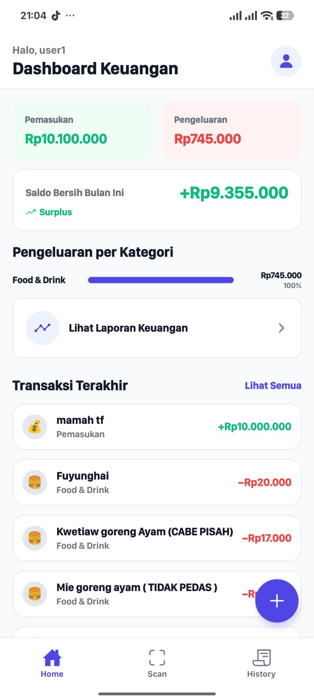
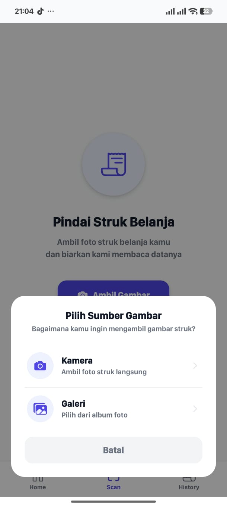
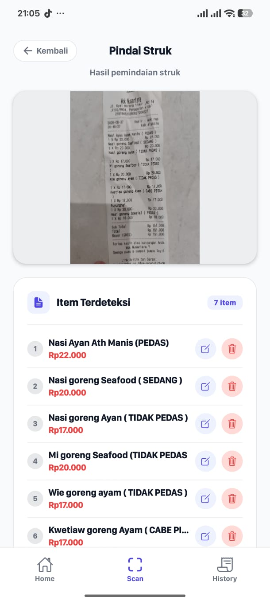
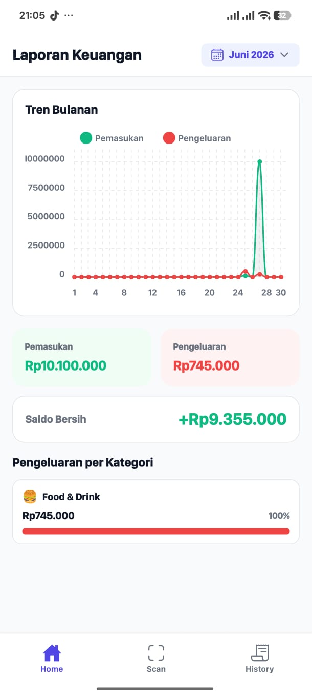
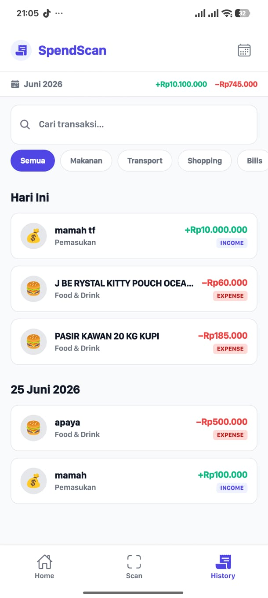
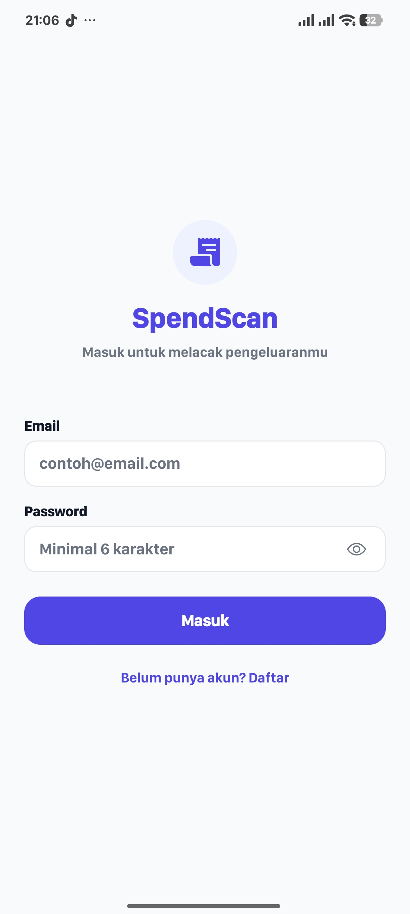

# SpendScan 🧾

**Smart Receipt Expense Tracker** — A mobile app for recording expenses and income, scanning receipts with AI-powered OCR, and viewing financial reports.

Built with React Native (Expo SDK 54) + Node.js backend + Supabase database + Groq AI for receipt parsing.

---

## ✨ Features

- **💰 Manual Tracking** — Add expenses and income with categories
- **📷 Receipt Scanning** — Take a photo of your receipt, and AI extracts items automatically
- **🧠 LLM-Powered Parsing** — Groq AI (Llama 3.3 70B) intelligently identifies items, prices, and dates from receipts
- **📋 Item Review** — Edit, delete, or add items before saving
- **📊 Dashboard** — Monthly income/expense/balance cards with category breakdown
- **📈 Report Screen** — Interactive line chart with daily trends and month picker
- **🔍 Transaction History** — Search, filter by category, filter by month
- **🔐 Authentication** — Register/login/logout with JWT token management
- **☁️ Cloud Storage** — Receipt images stored in Supabase Storage

---

## 🛠 Tech Stack

### Mobile App
| Library | Purpose |
|---------|---------|
| React Native + Expo SDK 54 | Cross-platform mobile framework |
| React Navigation | Tab + Stack navigation |
| @expo/vector-icons | Icon library |
| react-native-chart-kit | Line charts for reports |
| expo-image-picker | Camera & gallery access |
| expo-file-system | File reading for OCR upload |
| expo-secure-store | JWT token storage |
| date-fns | Date formatting |

### Backend
| Library | Purpose |
|---------|---------|
| Node.js + Express | API server |
| Supabase (PostgreSQL) | Database |
| Supabase Storage | Receipt image storage |
| Tesseract.js | OCR text extraction |
| Groq AI (Llama 3.3 70B) | Intelligent receipt parsing |
| OpenAI SDK | LLM API client (Groq-compatible) |
| jsonwebtoken | JWT authentication |
| bcryptjs | Password hashing |

---

## 📷 Screenshots

<table>
  <tr>
    <td></td>
    <td></td>
    <td></td>
  </tr>
  <tr>
    <td align="center"><em>Dashboard</em></td>
    <td align="center"><em>Scan Receipt</em></td>
    <td align="center"><em>Item Review</em></td>
  </tr>
  <tr>
    <td></td>
    <td></td>
    <td></td>
  </tr>
  <tr>
    <td align="center"><em>Report</em></td>
    <td align="center"><em>Transaction History</em></td>
    <td align="center"><em>Login</em></td>
  </tr>
</table>

> **Note:** Add actual screenshots to `docs/screenshots/` folder.

---

## 🚀 Getting Started

### Prerequisites

- Node.js 18+
- npm or yarn
- Expo Go app on your phone (Android/iOS)
- A Groq API key ([console.groq.com](https://console.groq.com))
- A Supabase project ([supabase.com](https://supabase.com))

### Installation

```bash
# Clone the repository
git clone https://github.com/Naitkomahli/SpendScan.git
cd SpendScan

# Install mobile dependencies
npm install

# Install backend dependencies
cd backend
npm install
cd ..
```

### Backend Setup

1. **Create a `.env` file** in `backend/`:

```env
PORT=3000

# Supabase
SUPABASE_URL=your_supabase_url
SUPABASE_ANON_KEY=your_anon_key
SUPABASE_SERVICE_ROLE_KEY=your_service_role_key

# JWT
JWT_SECRET=your_jwt_secret
JWT_EXPIRES_IN=7d

# LLM (Groq)
LLM_API_KEY=gsk_your_groq_api_key
LLM_BASE_URL=https://api.groq.com/openai/v1
LLM_MODEL=llama-3.3-70b-versatile
```

2. **Run database migration** in Supabase SQL Editor:

```sql
ALTER TABLE transactions ADD COLUMN type VARCHAR(10) NOT NULL DEFAULT 'expense'
CHECK (type IN ('income', 'expense'));
```

3. **Start the backend server**:

```bash
cd backend
node src/server.js
```

### Run Mobile App

```bash
# From project root
npx expo start
```

Scan the QR code with Expo Go on your phone. Make sure your phone and laptop are on the same WiFi network.

> ⚠️ **Important:** Update `BASE_URL` in `src/services/api.js` with your laptop's local IP address (e.g., `http://192.168.1.19:3000/api`).

---

## 📁 Project Structure

```
SpendScan/
├── App.js                      # Entry point with AuthProvider
├── src/
│   ├── components/             # Reusable UI components
│   │   ├── TransactionCard.jsx
│   │   ├── CategoryBadge.jsx
│   │   ├── EmptyState.jsx
│   │   └── Skeleton.jsx
│   ├── constants/              # App constants
│   │   ├── colors.js
│   │   └── categories.js
│   ├── contexts/
│   │   └── AuthContext.js      # Auth state management
│   ├── data/
│   │   └── mockTransactions.js # Mock data
│   ├── navigation/
│   │   └── AppNavigator.jsx    # Tab + Stack navigation
│   ├── screens/
│   │   ├── HomeScreen.jsx      # Dashboard
│   │   ├── AddTransactionScreen.jsx
│   │   ├── EditTransactionScreen.jsx
│   │   ├── TransactionListScreen.jsx
│   │   ├── TransactionDetailScreen.jsx
│   │   ├── LoginScreen.jsx
│   │   ├── ProfileScreen.jsx
│   │   ├── ReportScreen.jsx    # Line chart report
│   │   └── ScanScreen.jsx      # OCR scan + item review
│   ├── services/
│   │   ├── api.js              # API client (base fetch + token)
│   │   ├── authService.js
│   │   └── transactionService.js
│   └── utils/
│       └── formatCurrency.js
├── backend/
│   ├── .env                    # Environment variables
│   ├── src/
│   │   ├── server.js           # Express entry point
│   │   ├── config/
│   │   │   └── supabase.js
│   │   ├── controllers/
│   │   │   ├── authController.js
│   │   │   ├── transactionController.js
│   │   │   └── receiptController.js
│   │   ├── services/
│   │   │   └── llmParser.js    # Groq AI receipt parsing
│   │   ├── middleware/
│   │   │   ├── auth.js
│   │   │   └── errorHandler.js
│   │   ├── routes/
│   │   │   ├── auth.js
│   │   │   ├── transactions.js
│   │   │   └── receipts.js
│   │   └── db/
│   │       └── schema.sql
│   └── package.json
├── docs/
│   ├── PRD.md
│   └── MEMORY.md
└── README.md
```

---

## 📡 API Endpoints

| Method | Endpoint | Description | Auth Required |
|--------|----------|-------------|:---:|
| POST | `/api/auth/register` | Register new user | ❌ |
| POST | `/api/auth/login` | Login user | ❌ |
| GET | `/api/transactions` | Get all transactions | ✅ |
| GET | `/api/transactions/:id` | Get transaction by ID | ✅ |
| POST | `/api/transactions` | Create transaction | ✅ |
| PUT | `/api/transactions/:id` | Update transaction | ✅ |
| DELETE | `/api/transactions/:id` | Delete transaction | ✅ |
| POST | `/api/receipts/scan` | Upload & scan receipt | ✅ |

All responses follow `{ success: boolean, message: string, data: any }` format.

---

## 🔐 Environment Variables

### Backend (`backend/.env`)

| Variable | Required | Description |
|----------|:--------:|-------------|
| `PORT` | ❌ | Server port (default: 3000) |
| `SUPABASE_URL` | ✅ | Supabase project URL |
| `SUPABASE_ANON_KEY` | ✅ | Supabase anonymous key |
| `SUPABASE_SERVICE_ROLE_KEY` | ✅ | Supabase service role key |
| `JWT_SECRET` | ✅ | Secret for signing JWT tokens |
| `JWT_EXPIRES_IN` | ❌ | Token expiry (default: 7d) |
| `LLM_API_KEY` | ✅ | Groq API key |
| `LLM_BASE_URL` | ❌ | LLM provider URL (default: Groq) |
| `LLM_MODEL` | ❌ | LLM model (default: llama-3.3-70b-versatile) |

---

## 🧪 Testing Checklist

- [x] Register, login, logout
- [x] Token persists across app restarts
- [x] Add income & expense transactions
- [x] Dashboard shows income/expense/balance
- [x] Category breakdown with progress bars
- [x] Transaction list with month filter
- [x] Search & category filter
- [x] Edit & delete transactions
- [x] Report screen with line chart
- [x] Scan receipt → OCR → LLM parsing → item review
- [x] Edit/delete/add items in review screen
- [x] Batch save multiple transactions from one receipt
- [x] Profile screen with user info & logout

---

## 📄 License

This project is for educational and portfolio purposes.

---

## 👤 Author

**Orang A** — Mobile App Developer & Project Owner

---

## 🙏 Acknowledgments

- React Native & Expo teams
- Supabase for backend infrastructure
- Groq for free LLM API
- Tesseract.js for OCR engine
